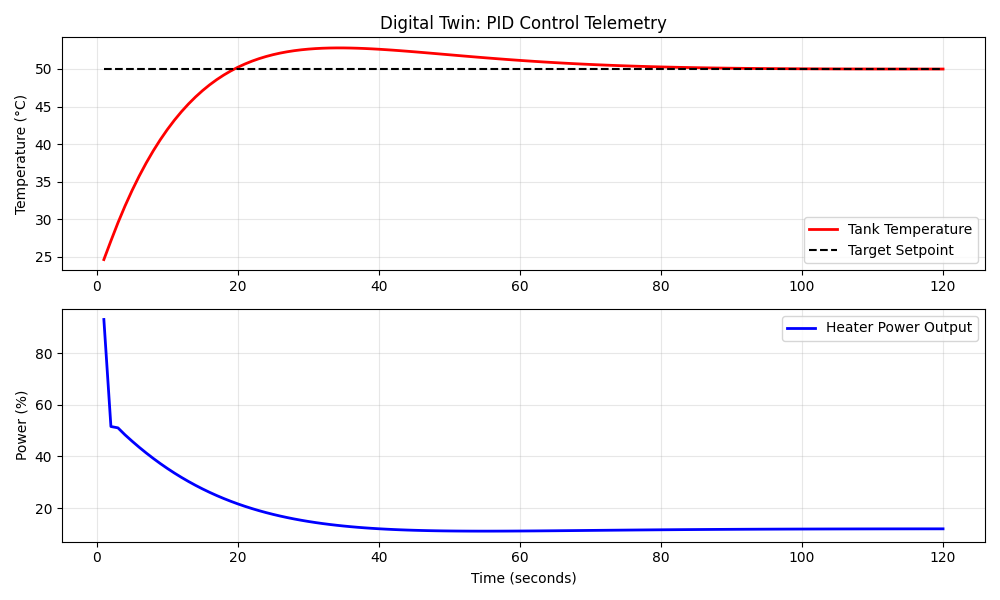

# PID Digital Twin: Thermodynamic Simulation & SIL Framework

A high-fidelity Software-in-the-Loop (SIL) simulation of an industrial heating system. This project utilizes a custom discrete-time PID controller to maintain a liquid tank's temperature against ambient thermal decay.

## 📊 System Telemetry

## 🚀 Technical Highlights
*   **Physics Engine:** Models Newton's Law of Cooling and thermal energy accumulation.
*   **PID Controller:** Implements Proportional, Integral, and Derivative logic from scratch.
*   **Data Visualization:** Real-time data logging and visualization using `matplotlib`.
*   **Professional DevOps:** Full version control with structured commit history and environment isolation via `.venv`.

## 🛠 Project Architecture
*   `digital_twin.py`: The "Plant" (Physical simulation of the tank).
*   `pid_controller.py`: The "Brain" (Control algorithm).
*   `main.py`: The "Integration" (Connects sensor data to control output).

## 📈 Performance Analysis
As seen in the telemetry graph:
1.  **Rise Time:** The system aggressively applies 90%+ power to reach the 50°C setpoint.
2.  **Overshoot Control:** The Derivative term senses the approach and dampens power to minimize overshoot.
3.  **Steady-State Stability:** The Integral term eliminates error, locking the system at 50°C with ~11.9% power to counteract ambient cooling.

## 🏃 How to Run
1.  Clone the repo: `git clone https://github.com/gokulv03/pid_digital_twin.git`
2.  Install dependencies: `pip install matplotlib`
3.  Execute: `python main.py`
